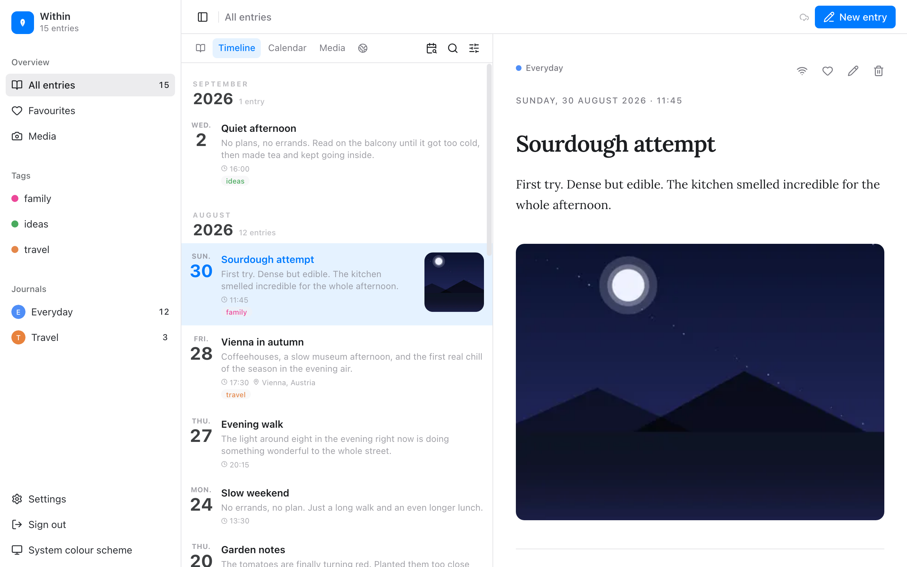
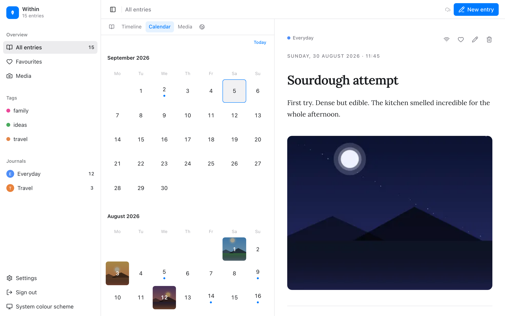
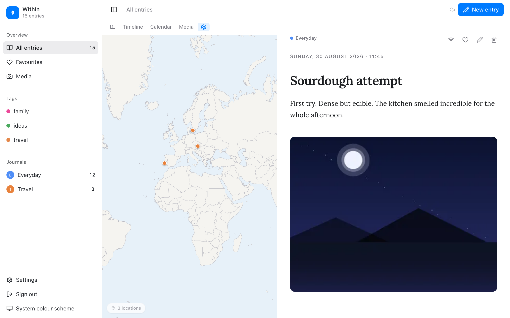
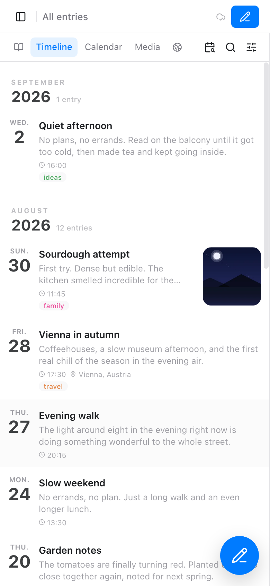

# Within

**A private journal that never leaves your home.** Within runs on a small server in your own network — a Raspberry Pi, a NAS, an old laptop — and you write from your phone or computer. No cloud, no account, no company reading along. *What's within stays within.*



- **Write** text with Markdown, add photos, videos and voice memos.
- **Find** entries again: timeline, calendar, map, tags, favourites, full-text search, and "On this day".
- **Take it with you:** install it on your phone as an app. Entries and pinned photos stay readable offline, encrypted on the device behind a PIN, and sync back when you are home.
- **Move in from Day One:** import your existing journal from a Day One export, photos and videos included.
- **Sleep well:** a nightly backup with an automatic restore check is part of the setup, not a chore.
- German, English and French interface.

<p>
  
  
</p>
<p align="center">
  
</p>

---

## What you need

| | Minimum |
|---|---|
| **A server in your home network** | Any 64-bit machine that runs Docker: Raspberry Pi 4/5 with **4 GB RAM or more**, a NAS, a mini PC, or a Mac/Windows computer with Docker Desktop. 32-bit systems and the Raspberry Pi 3 are not supported (no image for them). |
| **Docker** | Docker with Compose v2.23 or newer (`docker compose version`). On the Pi: install Docker via `curl -fsSL https://get.docker.com | sh`. |
| **Disk** | About 1 GB for the software, plus what your photos and videos need, plus the same again for the nightly backup. |
| **A fixed address** | The server needs a fixed IP address in your router (step 1 below). |

Within is built for **one person**. There is one password and one journal owner; two people who want separate diaries need two installations.

## Set up in 15 minutes

Everything runs from one file. You edit three lines, start it, and install one certificate on each device. Do it in this order.

### 1. Give your server a fixed address in the router

Within issues an HTTPS certificate for the address of your server. If the router hands out a different address after a restart, every device shows a certificate error and the app is blocked. So make the address permanent first:

- **FRITZ!Box:** *Home Network → Network → Network Connections* → click the pencil next to your server → tick *Always assign this network device the same IPv4 address* → OK.
- **Other routers:** look for *DHCP reservation*, *static lease* or *address reservation* under LAN/DHCP settings, pick your server and save the current address.

Write the address down (for example `192.168.1.50`). You will need it in step 2 and on every device.

### 2. Download the compose file and fill in three settings

On the server (or any computer that can reach it), create a folder **inside your home directory** and download the file:

```bash
mkdir -p ~/within && cd ~/within
curl -fsSLO https://raw.githubusercontent.com/within-app/within/main/docker-compose.yml
```

Open `docker-compose.yml` in any text editor. The first block looks like this — change the three values:

```yaml
x-settings: &settings
  APP_PASSWORD: "change-me"          # the password you will log in with
  APP_TIMEZONE: "UTC"                # e.g. Europe/Berlin, America/New_York
  APP_HOST_IP: "192.168.1.50"        # the fixed address from step 1
```

That is all. Database password, session keys and the certificate are created automatically on the first start. (If your password contains a `$`, write it as `$$`.)

> **Docker Desktop on Mac or Windows:** the folder must be inside your home directory (`~/within` is fine). Folders elsewhere are not shared with Docker and the start fails with `mounts denied`.
>
> The folder name becomes the name of the Docker project (`within`). If you already have a Docker project by that name from something else, use a different folder name — otherwise the two share volumes and the start fails with *password authentication failed*.

### 3. Start

```bash
docker compose up -d
```

The first start downloads about 1 GB and takes a few minutes. When `docker compose ps` shows `db` and `app` as *healthy* and `caddy` as *running*, the server is ready. A file `certificate/within-root-ca.crt` now sits next to your compose file — that is the certificate you install on your devices in the next steps.

Within stores its data in Docker volumes; `docker compose down` stops it without losing anything.

### 4. Trust the certificate on your computer

Your browser does not know the certificate authority Within created for your home, so you install its root certificate once per device. **Until you do, every browser shows a warning page ("Your connection is not private" / "Potential security risk"), and if you click through it, Within shows a screen saying "HTTPS required" instead of the journal.** That screen means exactly this step is still missing.

**Get the file onto the computer.** It is `certificate/within-root-ca.crt` next to your compose file. If you are sitting at a different computer, open `https://<address>/within-root-ca.crt` in the browser, click *Advanced* → *Proceed to <address>* on the warning, and the file downloads. (This is the one time clicking through the warning is right — the warning proves you do not have the certificate yet.)

**macOS**
1. Move the file to your Desktop. (A double-click straight inside a synced folder like iCloud Drive or Dropbox fails without any message.)
2. Double-click it. *Keychain Access* opens and shows *Caddy Local Authority – 2026 ECC Root* in the *login* keychain. If it says the certificate "could not be imported", it was already imported — continue.
3. In Keychain Access double-click that entry, open the *Trust* section, set *When using this certificate* to **Always Trust**, close the window and enter your Mac password.
4. **Quit the browser completely** (Cmd+Q, not just the window) and open it again. Safari and Chrome now show a closed padlock for `https://<address>`. **Firefox keeps its own store:** *Settings → Privacy & Security → Certificates → View Certificates… → Authorities → Import…*, choose the file, tick *Trust this CA to identify websites*.

**Windows**
1. Double-click the file → *Install Certificate…* → *Local Machine* → *Next*.
2. Choose *Place all certificates in the following store* → *Browse…* → **Trusted Root Certification Authorities** → *OK* → *Next* → *Finish* → confirm the security warning with *Yes*.
3. Close every browser window and start the browser again. Edge and Chrome now show the padlock. Firefox: import under *Settings → Privacy & Security → Certificates → View Certificates… → Authorities → Import…*.

**Linux (Debian/Ubuntu)**
```bash
sudo cp certificate/within-root-ca.crt /usr/local/share/ca-certificates/within-root-ca.crt
sudo update-ca-certificates
```
Chrome/Chromium and Firefox keep their own stores on Linux: *Settings → Privacy and security → Security → Manage certificates → Authorities → Import*, choose the file, tick *Trust this certificate for identifying websites*. Restart the browser.

### 5. Open the journal on your computer

Go to **`https://<address>`** — for example `https://192.168.1.50`. You see the Within login page with the padlock closed and no warning. Enter the password from step 2. Within then asks you to choose a PIN (at least 6 digits) for the encrypted offline copy on this device — type it twice. The empty timeline appears; tap *New entry* and write.

### 6. Put it on your phone

**Android (Chrome)**
1. Make sure the phone is in your home Wi-Fi. In Chrome type exactly **`https://<address>/within-root-ca.crt`** (the file name after the slash matters — without it you land on the app's start page). Chrome shows the warning "Your connection is not private". Tap **Advanced**, then **Proceed to <address> (unsafe)**. A download notification appears; nothing else opens.
2. Open the phone's *Settings* → **Security & privacy** → **More security settings** (on some phones: *More security & privacy*) → **Encryption & credentials** → **Install a certificate** → **CA certificate**. Android warns that this can let someone monitor traffic — tap **Install anyway** — and shows the file picker: choose **within-root-ca.crt** from *Downloads*. The screen says "CA certificate installed".
   Samsung: *Settings → Security and privacy → Other security settings → Install from device storage → CA certificate*. Pixel: *Settings → Security & privacy → More security & privacy → Encryption & credentials → Install a certificate → CA certificate*.
3. **Close Chrome completely** (open the recent-apps view and swipe Chrome away), then open Chrome again and go to **`https://<address>`**. No warning now, the padlock is closed, the login page appears. Log in with the password from step 2, choose a PIN (at least 6 digits) when asked.
4. Tap the **⋮** menu in Chrome → **Add to Home screen** (or **Install app**) → **Install**. Within now has its own icon and opens full-screen like any other app. Pinned photos and recent entries stay readable offline behind your PIN, and entries you write without a connection are sent when you are back home.

**iPhone / iPad (Safari)**
1. In Safari open `https://<address>/within-root-ca.crt`, tap *Show Details* → *visit this website* on the warning, then *Allow* on "This website is trying to download a configuration profile". You see "Profile Downloaded".
2. *Settings → General → VPN & Device Management* → tap the *Caddy Local Authority* profile → **Install** (top right) → enter your passcode → *Install* again → *Done*.
3. *Settings → General → About → Certificate Trust Settings* → switch on **Enable Full Trust** for *Caddy Local Authority – 2026 ECC Root* → *Continue*.
4. Close Safari from the app switcher, open `https://<address>` — no warning, padlock closed. Log in, choose a PIN, then tap the **Share** button → **Add to Home Screen** → **Add**.

You can only reach the journal while your phone is in your home Wi-Fi — that is the point. For writing on the road, see [Away from home](#away-from-home).

## Moving in from Day One

Within reads Day One's export. In Day One choose *Export → JSON*, which gives you a ZIP. Then in Within open *Settings → Import* and select that ZIP.

- **Expected format:** a ZIP with one or more `.json` files at the top level and media in `photos/`, `videos/` and `audios/` folders.
- **What comes across:** text, creation and modification dates, tags, favourites, location and weather data, the original entry ID, and all photos, videos and audio.
- **What does not:** PDF attachments. Day One can attach them, Within does not import them — keep those files separately.

Large journals are imported in batches; the page shows progress and you can keep the tab open in the background.

## Everyday things worth knowing

- **Your data stays home.** Nothing is sent anywhere. Even the map is bundled with the app — no map service on the internet is ever contacted.
- **Time zone.** Every entry is filed under the day and time of the zone in `APP_TIMEZONE`. If you travel, entries keep your home time.
- **PIN forgotten?** On the lock screen tap *Forgot PIN?* → *Delete local data & log in again*. That only deletes the encrypted **copy on that device** — your entries on the server are untouched. Log in again and pick a new PIN.
- **Offline.** Entries you write without a connection are queued on the device and sent when you are back home. Photos you pin are kept offline; the map needs a connection.
- **Export.** *Settings → Export* downloads a ZIP with `export.json` and all media — the same shape as the import, so you can move to another installation or just keep a copy.
- **Sizes.** Photos up to 20 MB, videos up to 100 MB and audio up to 50 MB per file by default. On a phone with little memory, turn on *Settings → Uploads → Shrink large photos before uploading*.
- **Search** uses German word stemming; searching in other languages works on exact words.

## Backups

The `backup` service in the compose file runs every night at 02:00 (your time zone): it dumps the database, mirrors your media folder and then **restores the dump into a scratch database to prove it can be read**. The result shows up under *Settings → Backup* in the app — green when the last run was fine, red when it failed or is older than a day.

By default backups go to `./backups` next to your compose file. **A copy on the same disk protects you from mistakes, not from a dead disk or a fire.** Plug in an external drive, mount it, and change this line in the `backup` service:

```yaml
      - ./backups:/backup        →      - /mnt/my-external-drive/within:/backup
```

Restoring, running a backup by hand, and how the retention works (7 daily + 4 weekly copies) are described in [docs/backup-restore.md](docs/backup-restore.md).

## Updating, and going back

Within is published as versions (`v1.0.0`, `v1.1.0`, …). The compose file follows `latest`:

```bash
docker compose pull && docker compose up -d
```

**Back to the previous version:** change the image line to a specific tag, e.g. `image: ghcr.io/within-app/within:v1.0.0`, and run `docker compose up -d`. This works as long as the database layout did not change in between — releases that change the database say so in their notes, and for those you restore the backup from before the update instead of downgrading.

## Away from home

Within is deliberately reachable only in your home network. If you want to write while travelling, the simplest safe way is **Tailscale** (or WireGuard): install it on the server and on your phone, then use the server's Tailscale address. You will need a certificate that covers that address too — the easiest route is to set `APP_HOST_IP` to the Tailscale IP and reinstall the certificate on your devices, or to put Within behind your own reverse proxy with its own certificate. Never forward port 443 on your router to Within.

## If something does not work

| What you see | Cause | What to do |
|---|---|---|
| Browser: *Your connection is not private* / *Potential security risk*; app: **"HTTPS required"** | The root certificate is not installed on this device, or the browser was not restarted after installing it. | Step 4 or 6 again; quit the browser fully; Firefox needs its own import. |
| The certificate was fine yesterday, now every device complains | The server got a new address from the router. | Fix the address in the router (step 1) so it matches `APP_HOST_IP`, or set `APP_HOST_IP` to the new address, run `docker compose up -d`, and install the **new** `certificate/within-root-ca.crt` on your devices. |
| `docker compose up` fails with *port is already allocated* | Port 443 or 80 is used by something else on the server. | In the `caddy` service change `"443:443"` to e.g. `"8443:443"` (and `"80:80"` to `"8080:80"`), start again, and use `https://<address>:8443`. |
| `docker compose up` fails with *mounts denied* (Mac/Windows) | The folder is outside your home directory. | Move it to `~/within` (or add the folder under Docker Desktop → Settings → Resources → File sharing). |
| `app` restarts in a loop, `docker compose logs app` shows *Kein Login-Passwort konfiguriert* | `APP_PASSWORD` is empty on the very first start. | Put a password in `APP_PASSWORD`, `docker compose up -d`. After the first start the line may be empty. |
| Containers get killed or the Pi freezes | Not enough memory. | Within reserves about 2.3 GB; use a machine with 4 GB or more, and no other heavy services next to it. |
| Login says *too many attempts* | Five wrong passwords within a minute from one device. | Wait a minute. |
| *Settings → Backup* is red | The backup folder is not mounted (external drive unplugged?) or the last run is older than a day. | `docker compose logs backup`; check the drive; run `docker compose exec backup bash scripts/backup/backup-full.sh` by hand. |

Logs: `docker compose logs app`, `docker compose logs caddy`, `docker compose logs backup`.

## Set up with an AI assistant

If you use an assistant such as Claude Code, Codex or Cursor, it can do the whole setup for you on the server. Point it at [docs/ai-assistant-setup.md](docs/ai-assistant-setup.md) (in the public repository the same text is in `CLAUDE.md`, which Claude Code reads on its own) and ask it to "install Within". It will find the server's address, fill in the compose file, start the stack and tell you what to do on your phone.

## Support and contributing

Bug reports are welcome as GitHub issues — there is no promise on response times. Contributions are welcome too; for anything bigger than a small fix, please open an issue first so we can talk about it. See [CONTRIBUTING.md](CONTRIBUTING.md) and [SECURITY.md](SECURITY.md) for reporting vulnerabilities privately.

## Tech

Next.js 16 · TypeScript · PostgreSQL 16 · Caddy · Docker Compose. Images for `linux/amd64` and `linux/arm64`.

## License

Within is free software under the [GNU AGPL-3.0](LICENSE), with an additional permission that lets independent modules talk to Within through its HTTP interface under a licence of their own. Contributions need the short [Contributor License Agreement](CLA.md).
